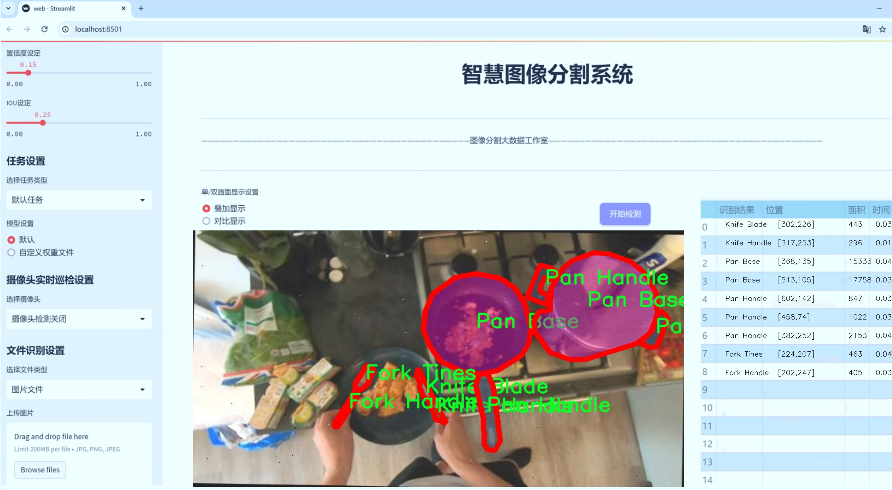
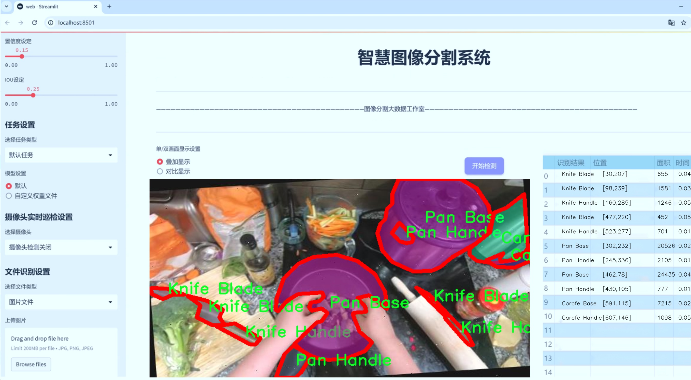
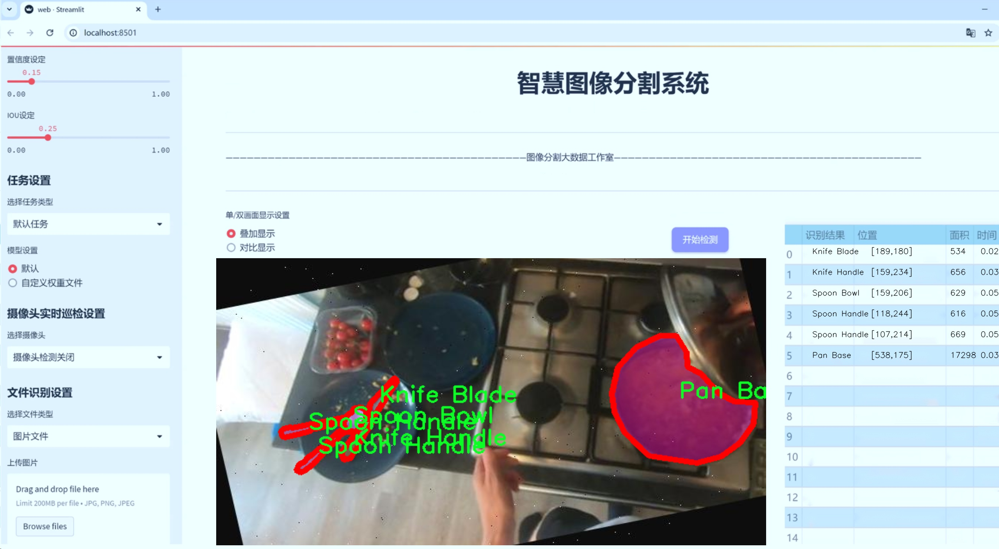
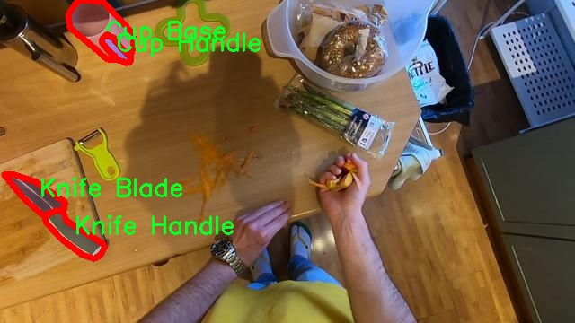
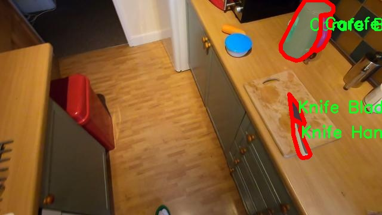
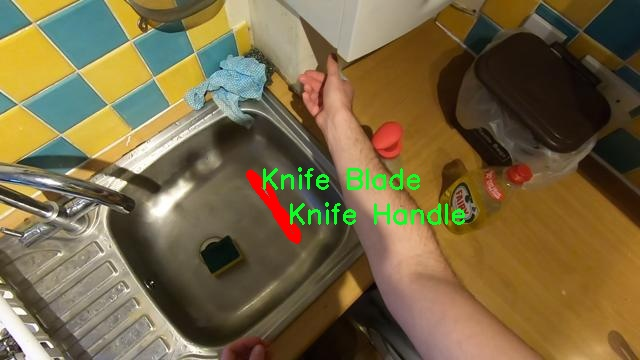
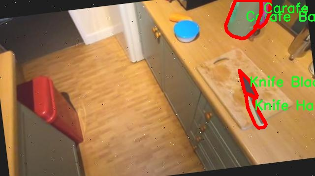
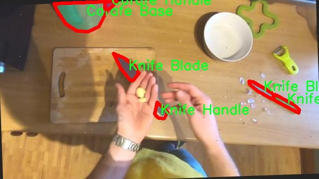

# 厨房常见厨具图像分割系统源码＆数据集分享
 [yolov8-seg-ContextGuidedDown＆yolov8-seg-EfficientRepBiPAN等50+全套改进创新点发刊_一键训练教程_Web前端展示]

### 1.研究背景与意义

项目参考[ILSVRC ImageNet Large Scale Visual Recognition Challenge](https://gitee.com/YOLOv8_YOLOv11_Segmentation_Studio/projects)

项目来源[AAAI Global Al lnnovation Contest](https://kdocs.cn/l/cszuIiCKVNis)

研究背景与意义

随着科技的迅猛发展，计算机视觉技术在各个领域的应用日益广泛，尤其是在智能家居和辅助生活方面，具有重要的现实意义。厨房作为家庭生活的重要场所，常常涉及到各种厨具的使用。对于低视力人群而言，厨房环境的复杂性和厨具的多样性给他们的日常生活带来了极大的挑战。因此，开发一种能够有效识别和分割厨房常见厨具的图像分割系统，尤其是基于先进的YOLOv8模型，具有重要的理论价值和实践意义。

在这一背景下，本研究旨在构建一个基于改进YOLOv8的厨房常见厨具图像分割系统。该系统将专注于对低视力用户的支持，帮助他们在厨房环境中更好地识别和使用各种厨具。通过对4900张图像的分析和处理，系统将能够识别18种不同类别的厨具，包括咖啡壶、杯子、刀具、勺子等。这些厨具的分类和分割不仅能够提升低视力人群的自信心和独立性，还能在一定程度上提高他们的生活质量。

在图像分割领域，YOLO（You Only Look Once）系列模型因其高效性和准确性而受到广泛关注。YOLOv8作为该系列的最新版本，具备更强的特征提取能力和更快的处理速度。通过对YOLOv8模型的改进，可以更好地适应厨房环境的复杂性，提升系统在实际应用中的表现。此外，针对厨房常见厨具的特征，设计相应的增强学习策略，将进一步提高模型的鲁棒性和准确性。

本研究不仅具有技术创新性，还具有重要的社会意义。随着人口老龄化的加剧，低视力人群的数量逐渐增加，如何为他们提供更好的生活支持成为社会关注的焦点。通过开发一套智能化的厨具识别和分割系统，可以有效减轻低视力人群在厨房操作中的困难，帮助他们更安全、便捷地进行烹饪。同时，该系统的推广应用还可以为其他相关领域的研究提供借鉴，推动智能辅助技术的发展。

综上所述，基于改进YOLOv8的厨房常见厨具图像分割系统的研究，不仅在技术上具有创新性，能够推动计算机视觉技术在实际应用中的进步，更在社会层面上具有深远的影响。通过提升低视力人群的生活质量，促进他们的独立性和自信心，本研究将为构建一个更加包容和便利的社会贡献力量。

### 2.图片演示







##### 注意：由于此博客编辑较早，上面“2.图片演示”和“3.视频演示”展示的系统图片或者视频可能为老版本，新版本在老版本的基础上升级如下：（实际效果以升级的新版本为准）

  （1）适配了YOLOV8的“目标检测”模型和“实例分割”模型，通过加载相应的权重（.pt）文件即可自适应加载模型。

  （2）支持“图片识别”、“视频识别”、“摄像头实时识别”三种识别模式。

  （3）支持“图片识别”、“视频识别”、“摄像头实时识别”三种识别结果保存导出，解决手动导出（容易卡顿出现爆内存）存在的问题，识别完自动保存结果并导出到tempDir中。

  （4）支持Web前端系统中的标题、背景图等自定义修改，后面提供修改教程。

  另外本项目提供训练的数据集和训练教程,暂不提供权重文件（best.pt）,需要您按照教程进行训练后实现图片演示和Web前端界面演示的效果。

### 3.视频演示

[3.1 视频演示](https://www.bilibili.com/video/BV1GNm5YXE9n/)

### 4.数据集信息展示

##### 4.1 本项目数据集详细数据（类别数＆类别名）

nc: 18
names: ['Carafe Base', 'Carafe Handle', 'Cup Base', 'Cup Handle', 'Fork Handle', 'Fork Tines', 'Knife Blade', 'Knife Handle', 'Ladle Bowl', 'Ladle Handle', 'Pan Base', 'Pan Handle', 'Scissor Blade', 'Scissor Handle', 'Spatula Handle', 'Spatula Head', 'Spoon Bowl', 'Spoon Handle']


##### 4.2 本项目数据集信息介绍

数据集信息展示

在本研究中，我们采用了名为“Low Vision Cooking”的数据集，以训练和改进YOLOv8-seg模型，旨在实现厨房常见厨具的图像分割系统。该数据集专门设计用于帮助视觉障碍人士在厨房环境中更好地识别和使用各种厨具，从而提升他们的独立性和生活质量。数据集包含18个类别，涵盖了厨房中常见的厨具，具体类别包括：Carafe Base（壶底）、Carafe Handle（壶把）、Cup Base（杯底）、Cup Handle（杯把）、Fork Handle（叉把）、Fork Tines（叉齿）、Knife Blade（刀刃）、Knife Handle（刀把）、Ladle Bowl（勺碗）、Ladle Handle（勺把）、Pan Base（锅底）、Pan Handle（锅把）、Scissor Blade（剪刀刃）、Scissor Handle（剪刀把）、Spatula Handle（铲把）、Spatula Head（铲头）、Spoon Bowl（勺碗）、Spoon Handle（勺把）。

数据集的构建过程中，特别注重了图像的多样性和代表性，以确保模型在实际应用中的有效性。每个类别的图像均经过精心挑选，涵盖了不同的角度、光照条件和背景环境，使得模型能够在各种情况下进行准确的分割和识别。此外，数据集中的图像标注采用了高精度的分割标注技术，确保每个厨具的边界清晰可辨，从而为YOLOv8-seg模型的训练提供了可靠的基础。

在训练过程中，数据集的多样性不仅提升了模型的鲁棒性，还使其能够适应不同用户的需求。视觉障碍人士在厨房中面临的挑战各不相同，因此，能够准确识别和分割各种厨具对于他们的日常生活至关重要。通过对“Low Vision Cooking”数据集的深入分析和应用，我们希望能够开发出一种智能化的辅助工具，帮助视觉障碍人士在厨房中更安全、更高效地进行烹饪。

此外，为了进一步提升模型的性能，我们还计划对数据集进行扩展和增强，增加更多的厨具类别和样本数量。这将有助于提高模型在复杂场景下的表现，使其能够处理更广泛的厨房环境和不同类型的厨具。通过不断优化数据集和模型，我们的目标是实现一个高度智能化的图像分割系统，不仅能够满足视觉障碍人士的需求，还能为其他用户提供便利。

总之，“Low Vision Cooking”数据集为我们改进YOLOv8-seg模型提供了丰富的资源和良好的基础。通过对该数据集的深入研究和应用，我们期待能够推动厨房辅助技术的发展，为视觉障碍人士创造一个更加友好的烹饪环境，帮助他们更好地融入日常生活。











### 5.全套项目环境部署视频教程（零基础手把手教学）

[5.1 环境部署教程链接（零基础手把手教学）](https://www.bilibili.com/video/BV1jG4Ve4E9t/?vd_source=bc9aec86d164b67a7004b996143742dc)


[5.2 安装Python虚拟环境创建和依赖库安装视频教程链接（零基础手把手教学）](https://www.bilibili.com/video/BV1nA4VeYEze/?vd_source=bc9aec86d164b67a7004b996143742dc)

### 6.手把手YOLOV8-seg训练视频教程（零基础小白有手就能学会）

[6.1 手把手YOLOV8-seg训练视频教程（零基础小白有手就能学会）](https://www.bilibili.com/video/BV1cA4VeYETe/?vd_source=bc9aec86d164b67a7004b996143742dc)


按照上面的训练视频教程链接加载项目提供的数据集，运行train.py即可开始训练



     Epoch   gpu_mem       box       obj       cls    labels  img_size
     1/200     0G   0.01576   0.01955  0.007536        22      1280: 100%|██████████| 849/849 [14:42<00:00,  1.04s/it]
               Class     Images     Labels          P          R     mAP@.5 mAP@.5:.95: 100%|██████████| 213/213 [01:14<00:00,  2.87it/s]
                 all       3395      17314      0.994      0.957      0.0957      0.0843

     Epoch   gpu_mem       box       obj       cls    labels  img_size
     2/200     0G   0.01578   0.01923  0.007006        22      1280: 100%|██████████| 849/849 [14:44<00:00,  1.04s/it]
               Class     Images     Labels          P          R     mAP@.5 mAP@.5:.95: 100%|██████████| 213/213 [01:12<00:00,  2.95it/s]
                 all       3395      17314      0.996      0.956      0.0957      0.0845

     Epoch   gpu_mem       box       obj       cls    labels  img_size
     3/200     0G   0.01561    0.0191  0.006895        27      1280: 100%|██████████| 849/849 [10:56<00:00,  1.29it/s]
               Class     Images     Labels          P          R     mAP@.5 mAP@.5:.95: 100%|███████   | 187/213 [00:52<00:00,  4.04it/s]
                 all       3395      17314      0.996      0.957      0.0957      0.0845


### 7.50+种全套YOLOV8-seg创新点代码加载调参视频教程（一键加载写好的改进模型的配置文件）

[7.1 50+种全套YOLOV8-seg创新点代码加载调参视频教程（一键加载写好的改进模型的配置文件）](https://www.bilibili.com/video/BV1Hw4VePEXv/?vd_source=bc9aec86d164b67a7004b996143742dc)

### 8.YOLOV8-seg图像分割算法原理

原始YOLOv8-seg算法原理

YOLOv8-seg算法是YOLO系列目标检测算法的最新进展，基于YOLOv8的框架，结合了目标检测与图像分割的功能，展现出卓越的性能和灵活性。该算法的设计理念是将目标检测与分割任务整合在一个统一的网络架构中，从而实现对图像中目标的精准定位和轮廓提取。YOLOv8-seg在YOLOv8的基础上进行了多项创新，尤其是在特征提取、特征融合和损失函数设计等方面，旨在提升模型在复杂场景下的表现。

首先，YOLOv8-seg依然采用了输入层、主干网络、特征融合层和解耦头的结构，保持了YOLO系列一贯的高效性和准确性。输入层负责对图像进行预处理，将其调整为640x640的RGB格式，并应用一系列数据增强技术，如马赛克增强、混合增强、空间扰动和颜色扰动，以提升模型的泛化能力和鲁棒性。通过这些预处理步骤，YOLOv8-seg能够有效地应对不同光照、角度和背景下的目标检测与分割任务。

在主干网络方面，YOLOv8-seg延续了YOLOv5的CSPDarknet架构，并将C3模块替换为C2f模块。这一改进不仅保持了轻量化的特性，还显著提高了特征提取的效率。C2f模块通过引入ELAN思想，采用了多分支结构，能够在梯度回传过程中有效缓解深层网络中的梯度消失问题。这种设计使得模型能够更好地捕捉图像中的细节特征，从而提升目标检测和分割的精度。

特征融合层采用了PAN-FPN结构，旨在实现多尺度特征的深度融合。YOLOv8-seg通过自下而上的特征融合，结合高层特征与中层、浅层特征，确保不同尺度的信息能够有效传递。这一过程不仅增强了模型对小目标的检测能力，还提升了对复杂背景下目标的分割效果。通过将不同层次的特征进行拼接和加权，YOLOv8-seg能够在多种场景下保持高效的目标识别与分割性能。

在解耦头的设计上，YOLOv8-seg借鉴了YOLOX和YOLOv6的思路，采用了解耦结构，将分类和回归任务分开处理。这一设计使得模型在进行目标分类和边框回归时，能够更加专注于各自的任务，从而提高整体的检测精度。YOLOv8-seg的头部输出三个不同尺度的特征图，分别对应于80x80、40x40和20x20的特征图，这些特征图不仅包含了目标的类别信息，还包括了分割所需的边界信息。

为了进一步提升模型的性能，YOLOv8-seg在损失函数的设计上进行了创新。它采用了VFLLoss作为分类损失，DFLLoss与CIoULoss作为回归损失，形成了一种新的损失计算机制。这种机制通过对正负样本进行不对称加权，能够有效地处理样本不平衡问题，特别是在目标较小或数量较少的情况下。VFLLoss的设计使得模型能够更关注高质量的正样本，同时降低负样本对损失的影响，从而加速模型的收敛并提升检测精度。

此外，YOLOv8-seg在样本匹配策略上也进行了改进。通过采用TaskAligned的Assigner匹配方式，YOLOv8-seg能够更灵活地处理不同尺度和类别的目标，确保每个样本都能得到合理的匹配。这一策略的引入，使得模型在训练过程中能够更有效地学习到目标的特征，从而提升整体的检测与分割性能。

总的来说，YOLOv8-seg算法通过对YOLOv8的结构和功能进行优化，结合了目标检测与图像分割的任务，展现出强大的性能。其创新的网络架构、特征融合策略和损失函数设计，使得YOLOv8-seg在复杂场景下依然能够保持高效的目标识别与分割能力。这一算法的提出，不仅为目标检测领域带来了新的思路，也为实际应用中的目标分割任务提供了有力的支持。随着YOLOv8-seg的不断发展与完善，未来在智能监控、自动驾驶、医疗影像等领域的应用前景将更加广阔。


### 9.系统功能展示（检测对象为举例，实际内容以本项目数据集为准）

图9.1.系统支持检测结果表格显示

  图9.2.系统支持置信度和IOU阈值手动调节

  图9.3.系统支持自定义加载权重文件best.pt(需要你通过步骤5中训练获得)

  图9.4.系统支持摄像头实时识别

  图9.5.系统支持图片识别

  图9.6.系统支持视频识别

  图9.7.系统支持识别结果文件自动保存

  图9.8.系统支持Excel导出检测结果数据


### 10.50+种全套YOLOV8-seg创新点原理讲解（非科班也可以轻松写刊发刊，V11版本正在科研待更新）

#### 10.1 由于篇幅限制，每个创新点的具体原理讲解就不一一展开，具体见下列网址中的创新点对应子项目的技术原理博客网址【Blog】：


[10.1 50+种全套YOLOV8-seg创新点原理讲解链接](https://gitee.com/qunmasj/good)

#### 10.2 部分改进模块原理讲解(完整的改进原理见上图和技术博客链接)【如果此小节的图加载失败可以通过CSDN或者Github搜索该博客的标题访问原始博客，原始博客图片显示正常】
### YOLOv8简介
#### Yolov8网络模型
Yolov8n的网络分为输入端、主干网( Back-bone) 、Neck模块和输出端4个部分（图4)。输
人端主要有马赛克( Mosaic）数据增强、自适应锚框计算和自适应灰度填充。主干网有Conv、C2和SPPF结构，其中，C2r模块是对残差特征进行学习的主要模块，该模块仿照Yolov7的ELAN结构,通过更多的分支跨层连接，丰富了模型的梯度流，可形成一个具有更强特征表示能力的神经网络模
块。Neck模块采用PAN ( path aggregation nelwOrk ,结构，可加强网络对不同缩放尺度对象特征融合的
能力。输出端将分类和检测过程进行解耦，主要包括损失计算和目标检测框筛选，其中，损失计算过程主要包括正负样本分配策略和 Loss计算，Yolov8n 网络主要使用TaskAlignedAssignerl 10]方法，即根据分类与回归的分数加权结果选择正样本;Loss计算包括分类和回归2个分支，无Ob-jecIness分支。分类分支依然采用BCE Loss，回归分支则使用了Distribution Focal Loss!11〕和CIOU( complele inlersection over union)损失函数。

### 可扩张残差（DWR）注意力模块
当前的许多工作直接采用多速率深度扩张卷积从一个输入特征图中同时捕获多尺度上下文信息，从而提高实时语义分割的特征提取效率。 然而，这种设计可能会因为结构和超参数的不合理而导致多尺度上下文信息的访问困难。 为了降低绘制多尺度上下文信息的难度，我们提出了一种高效的多尺度特征提取方法，该方法分解了原始的单步特征提取方法方法分为两个步骤，区域残差-语义残差。 在该方法中，多速率深度扩张卷积在特征提取中发挥更简单的作用：根据第一步提供的每个简明区域形式特征图，在第二步中使用一个所需的感受野执行简单的基于语义的形态过滤 一步，提高他们的效率。 此外，扩张率和扩张卷积的容量每个网络阶段都经过精心设计，以充分利用所有可以实现的区域形式的特征图。 因此，我们分别为高层和低层网络设计了一种新颖的扩张式残差（DWR）模块和简单倒置残差（SIR）模块。


首先，该博客引入了一个Dilation-wise Residual（DWR）模块，用于提取网络高层的特征，如图2a所示。多分支结构用于扩展感受野，其中每个分支采用不同空洞率的空洞深度卷积。
然后，专门设计了一个Simple Inverted Residual（SIR）模块来提取网络低层的特征，如图2b所示。该模块仅具有3×3的微小感受野，但使用inverted bottleneck式结构来扩展通道数量，确保更强的特征提取能力。
最后，基于DWR和SIR模块，构建了一个编码器-解码器风格的网络DWRSeg，其中解码器采用了简单的类似FCN的结构。解码器使用来自最后两个阶段的强语义信息直接对特征图进行上采样，然后将它们与来自较低阶段的特征图（包含丰富的详细信息）拼接起来，以进行最终预测。


### 11.项目核心源码讲解（再也不用担心看不懂代码逻辑）

#### 11.1 ui.py

以下是对代码的核心部分进行提炼和详细注释的版本：

```python
import sys
import subprocess

def run_script(script_path):
    """
    使用当前 Python 环境运行指定的脚本。

    Args:
        script_path (str): 要运行的脚本路径

    Returns:
        None
    """
    # 获取当前 Python 解释器的路径
    python_path = sys.executable

    # 构建运行命令，使用 streamlit 运行指定的脚本
    command = f'"{python_path}" -m streamlit run "{script_path}"'

    # 执行命令并等待其完成
    result = subprocess.run(command, shell=True)
    
    # 检查命令执行的返回码，非零表示出错
    if result.returncode != 0:
        print("脚本运行出错。")

# 程序入口
if __name__ == "__main__":
    # 指定要运行的脚本路径
    script_path = "web.py"  # 假设脚本在当前目录下

    # 调用函数运行脚本
    run_script(script_path)
```

### 代码分析与注释：

1. **导入模块**：
   - `sys`：用于访问与 Python 解释器相关的变量和函数。
   - `subprocess`：用于创建新进程、连接到它们的输入/输出/错误管道，并获得它们的返回码。

2. **`run_script` 函数**：
   - 该函数接收一个脚本路径作为参数，并使用当前 Python 环境运行该脚本。
   - 使用 `sys.executable` 获取当前 Python 解释器的路径，以确保使用正确的 Python 版本来运行脚本。
   - 构建一个命令字符串，使用 `streamlit` 模块运行指定的脚本。
   - `subprocess.run` 方法用于执行构建的命令，并等待其完成。`shell=True` 允许在 shell 中执行命令。
   - 检查命令的返回码，如果返回码不为零，表示脚本运行出错，打印错误信息。

3. **程序入口**：
   - 使用 `if __name__ == "__main__":` 确保该部分代码仅在直接运行该脚本时执行，而不是作为模块导入时执行。
   - 指定要运行的脚本路径，这里假设脚本 `web.py` 在当前目录下。
   - 调用 `run_script` 函数，传入脚本路径以执行该脚本。 

以上是对代码的核心部分提炼和详细注释，保留了代码的主要功能和结构。

这个程序文件名为 `ui.py`，其主要功能是运行一个指定的 Python 脚本，具体来说是使用 Streamlit 框架来启动一个 Web 应用。

首先，文件中导入了一些必要的模块，包括 `sys`、`os` 和 `subprocess`。其中，`sys` 模块用于访问与 Python 解释器相关的变量和函数，`os` 模块提供了与操作系统交互的功能，而 `subprocess` 模块则用于创建新进程、连接到它们的输入/输出/错误管道，并获取它们的返回码。

接下来，文件中定义了一个名为 `run_script` 的函数，该函数接受一个参数 `script_path`，表示要运行的脚本的路径。在函数内部，首先获取当前 Python 解释器的路径，使用 `sys.executable` 来实现。然后，构建一个命令字符串，命令的格式是调用 Python 解释器并通过 `-m` 参数运行 Streamlit，并指定要运行的脚本路径。

接着，使用 `subprocess.run` 方法执行构建好的命令。如果命令执行的返回码不为 0，表示脚本运行出错，程序会打印出错误信息。

在文件的最后部分，使用 `if __name__ == "__main__":` 语句来确保只有在直接运行该脚本时才会执行以下代码。这里指定了要运行的脚本路径为 `web.py`，并调用 `run_script` 函数来执行该脚本。

总体来说，这个程序的目的是为了方便地启动一个 Streamlit Web 应用，通过指定脚本路径来运行相应的 Python 文件。

#### 11.2 ultralytics\nn\backbone\convnextv2.py

以下是经过简化和注释的核心代码部分，保留了主要的类和函数，并对其进行了详细的中文注释：

```python
import torch
import torch.nn as nn
import torch.nn.functional as F
from timm.models.layers import trunc_normal_, DropPath

class LayerNorm(nn.Module):
    """ 自定义的LayerNorm层，支持两种数据格式：channels_last（默认）和channels_first。
    channels_last对应输入形状为(batch_size, height, width, channels)，
    而channels_first对应输入形状为(batch_size, channels, height, width)。
    """
    def __init__(self, normalized_shape, eps=1e-6, data_format="channels_last"):
        super().__init__()
        self.weight = nn.Parameter(torch.ones(normalized_shape))  # 权重参数
        self.bias = nn.Parameter(torch.zeros(normalized_shape))    # 偏置参数
        self.eps = eps
        self.data_format = data_format
        if self.data_format not in ["channels_last", "channels_first"]:
            raise NotImplementedError 
        self.normalized_shape = (normalized_shape, )
    
    def forward(self, x):
        """ 前向传播，执行LayerNorm操作 """
        if self.data_format == "channels_last":
            return F.layer_norm(x, self.normalized_shape, self.weight, self.bias, self.eps)
        elif self.data_format == "channels_first":
            u = x.mean(1, keepdim=True)  # 计算均值
            s = (x - u).pow(2).mean(1, keepdim=True)  # 计算方差
            x = (x - u) / torch.sqrt(s + self.eps)  # 标准化
            x = self.weight[:, None, None] * x + self.bias[:, None, None]  # 应用权重和偏置
            return x

class Block(nn.Module):
    """ ConvNeXtV2中的基本块，包含深度卷积、规范化、激活和线性层 """
    def __init__(self, dim, drop_path=0.):
        super().__init__()
        self.dwconv = nn.Conv2d(dim, dim, kernel_size=7, padding=3, groups=dim)  # 深度卷积
        self.norm = LayerNorm(dim, eps=1e-6)  # 规范化层
        self.pwconv1 = nn.Linear(dim, 4 * dim)  # 1x1卷积（线性层）
        self.act = nn.GELU()  # 激活函数
        self.pwconv2 = nn.Linear(4 * dim, dim)  # 1x1卷积（线性层）
        self.drop_path = DropPath(drop_path) if drop_path > 0. else nn.Identity()  # 随机深度

    def forward(self, x):
        """ 前向传播，执行ConvNeXtV2块的操作 """
        input = x
        x = self.dwconv(x)  # 深度卷积
        x = x.permute(0, 2, 3, 1)  # 维度变换
        x = self.norm(x)  # 规范化
        x = self.pwconv1(x)  # 1x1卷积
        x = self.act(x)  # 激活
        x = self.pwconv2(x)  # 1x1卷积
        x = x.permute(0, 3, 1, 2)  # 恢复维度

        x = input + self.drop_path(x)  # 残差连接
        return x

class ConvNeXtV2(nn.Module):
    """ ConvNeXt V2模型 """
    def __init__(self, in_chans=3, num_classes=1000, 
                 depths=[3, 3, 9, 3], dims=[96, 192, 384, 768], 
                 drop_path_rate=0., head_init_scale=1.
                 ):
        super().__init__()
        self.downsample_layers = nn.ModuleList()  # 下采样层
        stem = nn.Sequential(
            nn.Conv2d(in_chans, dims[0], kernel_size=4, stride=4),  # 初始卷积层
            LayerNorm(dims[0], eps=1e-6, data_format="channels_first")  # 规范化层
        )
        self.downsample_layers.append(stem)
        for i in range(3):
            downsample_layer = nn.Sequential(
                    LayerNorm(dims[i], eps=1e-6, data_format="channels_first"),
                    nn.Conv2d(dims[i], dims[i+1], kernel_size=2, stride=2),  # 下采样卷积层
            )
            self.downsample_layers.append(downsample_layer)

        self.stages = nn.ModuleList()  # 特征分辨率阶段
        for i in range(4):
            stage = nn.Sequential(
                *[Block(dim=dims[i]) for _ in range(depths[i])]  # 添加多个Block
            )
            self.stages.append(stage)

        self.norm = nn.LayerNorm(dims[-1], eps=1e-6)  # 最终规范化层
        self.head = nn.Linear(dims[-1], num_classes)  # 分类头

    def forward(self, x):
        """ 前向传播，执行下采样和特征提取 """
        res = []
        for i in range(4):
            x = self.downsample_layers[i](x)  # 下采样
            x = self.stages[i](x)  # 特征提取
            res.append(x)
        return res  # 返回特征图

# 更新模型权重的函数
def update_weight(model_dict, weight_dict):
    idx, temp_dict = 0, {}
    for k, v in weight_dict.items():
        if k in model_dict.keys() and np.shape(model_dict[k]) == np.shape(v):
            temp_dict[k] = v
            idx += 1
    model_dict.update(temp_dict)  # 更新权重
    print(f'loading weights... {idx}/{len(model_dict)} items')
    return model_dict

# 创建不同规模的ConvNeXtV2模型的函数
def convnextv2_tiny(weights='', **kwargs):
    model = ConvNeXtV2(depths=[3, 3, 9, 3], dims=[96, 192, 384, 768], **kwargs)
    if weights:
        model.load_state_dict(update_weight(model.state_dict(), torch.load(weights)['model']))
    return model
```

### 主要功能概述：
1. **LayerNorm**：实现了自定义的层归一化，支持不同的数据格式。
2. **Block**：定义了ConvNeXtV2的基本构建块，包含深度卷积、规范化、激活和残差连接。
3. **ConvNeXtV2**：整体模型结构，包含下采样层和多个特征提取阶段。
4. **update_weight**：用于更新模型权重的函数。
5. **convnextv2_tiny**：创建特定规模的ConvNeXtV2模型并加载权重的函数。

这个程序文件定义了一个名为 `ConvNeXtV2` 的深度学习模型，主要用于图像分类任务。该模型基于卷积神经网络（CNN），并引入了一些新的层和结构以提高性能。

首先，文件中导入了必要的库，包括 PyTorch 及其相关模块，以及 NumPy 和 `timm` 库中的一些功能。文件开头还包含版权信息和许可协议。

接下来，定义了几个类：

1. **LayerNorm**：实现了层归一化（Layer Normalization），支持两种数据格式：`channels_last` 和 `channels_first`。根据输入的维度格式，计算归一化的方式有所不同。

2. **GRN**：全局响应归一化（Global Response Normalization）层，通过计算输入的 L2 范数来进行归一化，并使用可学习的参数 `gamma` 和 `beta` 来调整输出。

3. **Block**：这是 ConvNeXtV2 的基本构建块，包含深度可分离卷积、层归一化、点卷积、激活函数（GELU）和 GRN。它使用了残差连接，并在必要时应用随机深度（Drop Path）以提高模型的泛化能力。

4. **ConvNeXtV2**：这是主模型类，包含多个阶段，每个阶段由多个 `Block` 组成。模型的构造参数包括输入通道数、分类头的类别数、每个阶段的块数、特征维度、随机深度率等。模型的前向传播过程包括对输入进行下采样和通过各个阶段的处理。

在模型的初始化过程中，定义了一个权重初始化函数 `_init_weights`，用于对卷积层和线性层的权重进行初始化。

模型的前向传播方法 `forward` 会依次通过下采样层和各个阶段，最终返回特征图。

此外，文件还定义了一个 `update_weight` 函数，用于更新模型的权重字典，确保加载的权重与模型结构匹配。

最后，提供了一系列函数（如 `convnextv2_atto`、`convnextv2_femto` 等），用于创建不同规模的 ConvNeXtV2 模型。这些函数允许用户指定预训练权重的路径，并在创建模型时加载这些权重。

总体而言，这个文件实现了一个灵活且高效的卷积神经网络架构，适用于各种图像分类任务，并提供了多种模型配置以满足不同的需求。

#### 11.3 ultralytics\nn\modules\transformer.py

以下是经过简化和注释的核心代码部分，主要集中在 `TransformerEncoderLayer` 和 `AIFI` 类上：

```python
import torch
import torch.nn as nn
import torch.nn.functional as F

class TransformerEncoderLayer(nn.Module):
    """定义一个Transformer编码器层。"""

    def __init__(self, c1, cm=2048, num_heads=8, dropout=0.0, act=nn.GELU(), normalize_before=False):
        """初始化TransformerEncoderLayer，设置参数。"""
        super().__init__()
        # 使用多头自注意力机制
        self.ma = nn.MultiheadAttention(c1, num_heads, dropout=dropout, batch_first=True)
        # 前馈神经网络
        self.fc1 = nn.Linear(c1, cm)  # 第一层线性变换
        self.fc2 = nn.Linear(cm, c1)  # 第二层线性变换

        # 归一化层
        self.norm1 = nn.LayerNorm(c1)
        self.norm2 = nn.LayerNorm(c1)
        self.dropout = nn.Dropout(dropout)
        self.dropout1 = nn.Dropout(dropout)
        self.dropout2 = nn.Dropout(dropout)

        self.act = act  # 激活函数
        self.normalize_before = normalize_before  # 是否在前面进行归一化

    def forward_post(self, src, src_mask=None, src_key_padding_mask=None, pos=None):
        """后归一化的前向传播。"""
        q = k = self.with_pos_embed(src, pos)  # 添加位置嵌入
        src2 = self.ma(q, k, value=src, attn_mask=src_mask, key_padding_mask=src_key_padding_mask)[0]  # 自注意力
        src = src + self.dropout1(src2)  # 残差连接
        src = self.norm1(src)  # 归一化
        src2 = self.fc2(self.dropout(self.act(self.fc1(src))))  # 前馈网络
        src = src + self.dropout2(src2)  # 残差连接
        return self.norm2(src)  # 返回归一化后的输出

    def forward(self, src, src_mask=None, src_key_padding_mask=None, pos=None):
        """前向传播，选择归一化方式。"""
        if self.normalize_before:
            return self.forward_pre(src, src_mask, src_key_padding_mask, pos)
        return self.forward_post(src, src_mask, src_key_padding_mask, pos)

class AIFI(TransformerEncoderLayer):
    """定义AIFI变换层。"""

    def __init__(self, c1, cm=2048, num_heads=8, dropout=0, act=nn.GELU(), normalize_before=False):
        """初始化AIFI实例，设置参数。"""
        super().__init__(c1, cm, num_heads, dropout, act, normalize_before)

    def forward(self, x):
        """AIFI变换层的前向传播。"""
        c, h, w = x.shape[1:]  # 获取输入的通道数、高度和宽度
        pos_embed = self.build_2d_sincos_position_embedding(w, h, c)  # 构建2D位置嵌入
        # 将输入从[B, C, H, W]展平为[B, HxW, C]
        x = super().forward(x.flatten(2).permute(0, 2, 1), pos=pos_embed.to(device=x.device, dtype=x.dtype))
        return x.permute(0, 2, 1).view([-1, c, h, w]).contiguous()  # 恢复为原始形状

    @staticmethod
    def build_2d_sincos_position_embedding(w, h, embed_dim=256, temperature=10000.0):
        """构建2D正弦余弦位置嵌入。"""
        grid_w = torch.arange(int(w), dtype=torch.float32)
        grid_h = torch.arange(int(h), dtype=torch.float32)
        grid_w, grid_h = torch.meshgrid(grid_w, grid_h, indexing='ij')  # 创建网格
        assert embed_dim % 4 == 0, '嵌入维度必须是4的倍数'
        pos_dim = embed_dim // 4
        omega = torch.arange(pos_dim, dtype=torch.float32) / pos_dim
        omega = 1. / (temperature ** omega)

        out_w = grid_w.flatten()[..., None] @ omega[None]
        out_h = grid_h.flatten()[..., None] @ omega[None]

        return torch.cat([torch.sin(out_w), torch.cos(out_w), torch.sin(out_h), torch.cos(out_h)], 1)[None]
```

### 代码说明
1. **TransformerEncoderLayer**: 这是一个基本的Transformer编码器层，包含多头自注意力机制和前馈神经网络。它支持后归一化和前归一化两种模式。
   - `__init__`: 初始化各个层，包括多头注意力、前馈网络和归一化层。
   - `forward_post`: 实现后归一化的前向传播逻辑。
   - `forward`: 根据`normalize_before`参数选择使用后归一化或前归一化的前向传播方法。

2. **AIFI**: 继承自`TransformerEncoderLayer`，实现了一个特定的变换层，主要用于处理图像数据。
   - `forward`: 在前向传播中，首先构建2D位置嵌入，然后将输入展平，调用父类的`forward`方法进行处理，最后恢复为原始形状。
   - `build_2d_sincos_position_embedding`: 生成2D正弦余弦位置嵌入，用于增强模型对空间信息的理解。

通过这些核心部分的注释，可以更好地理解Transformer编码器层的工作原理及其在处理图像数据时的应用。

这个程序文件是Ultralytics YOLO（You Only Look Once）模型的一部分，主要实现了Transformer模块，适用于目标检测等计算机视觉任务。文件中定义了多个类，每个类代表了Transformer架构中的不同组件。

首先，`TransformerEncoderLayer`类定义了Transformer编码器的单层结构。它包含多头自注意力机制和前馈神经网络。初始化时需要指定输入通道数、隐藏层大小、头数、丢弃率等参数。该类支持两种前向传播方式：后归一化和前归一化，具体取决于`normalize_before`参数的设置。`forward`方法根据该参数选择相应的前向传播实现。

接下来，`AIFI`类是`TransformerEncoderLayer`的一个子类，专门用于处理二维输入数据。它在前向传播中构建了二维正弦余弦位置嵌入，并将输入展平以适应Transformer的输入格式。

`TransformerLayer`类实现了一个基本的Transformer层，包含线性变换和多头注意力机制。它的前向传播方法将输入通过注意力机制和前馈网络处理。

`TransformerBlock`类实现了一个完整的Transformer模块，支持位置嵌入和多个层的堆叠。它在输入通道数不同时使用卷积层进行通道转换，并将输入展平以适应Transformer的输入格式。

`MLPBlock`和`MLP`类实现了多层感知机（MLP），前者是一个单独的MLP块，后者则是一个完整的MLP结构，支持多个层的堆叠。

`LayerNorm2d`类实现了二维层归一化，适用于处理图像数据。它通过计算均值和方差对输入进行归一化，并应用可学习的权重和偏置。

`MSDeformAttn`类实现了多尺度可变形注意力机制，适用于处理不同尺度的特征图。它通过采样偏移和注意力权重对输入进行加权，支持在多个尺度上进行特征融合。

`DeformableTransformerDecoderLayer`和`DeformableTransformerDecoder`类实现了可变形Transformer解码器的层和整体结构。解码器层包含自注意力和交叉注意力机制，能够处理输入特征和参考边界框。解码器的前向传播方法通过多层堆叠实现对目标的逐步细化。

整体来看，这个文件实现了Transformer在目标检测中的应用，结合了多头注意力、前馈网络、位置嵌入和可变形注意力等技术，旨在提高模型对复杂场景的理解和处理能力。

#### 11.4 ultralytics\hub\session.py

以下是代码中最核心的部分，并附上详细的中文注释：

```python
import signal
import sys
from pathlib import Path
from time import sleep
import requests
from ultralytics.hub.utils import HUB_API_ROOT, HUB_WEB_ROOT, smart_request
from ultralytics.utils import LOGGER, __version__, checks, is_colab
from ultralytics.utils.errors import HUBModelError

AGENT_NAME = f'python-{__version__}-colab' if is_colab() else f'python-{__version__}-local'

class HUBTrainingSession:
    """
    HUBTrainingSession类用于Ultralytics HUB YOLO模型的训练会话，处理模型初始化、心跳和检查点上传。
    """

    def __init__(self, url):
        """
        初始化HUBTrainingSession，使用提供的模型标识符。

        参数:
            url (str): 用于初始化HUB训练会话的模型标识符，可以是URL字符串或特定格式的模型键。

        异常:
            ValueError: 如果提供的模型标识符无效。
            ConnectionError: 如果连接全局API密钥不被支持。
        """
        from ultralytics.hub.auth import Auth

        # 解析输入的URL
        if url.startswith(f'{HUB_WEB_ROOT}/models/'):
            url = url.split(f'{HUB_WEB_ROOT}/models/')[-1]
        if [len(x) for x in url.split('_')] == [42, 20]:
            key, model_id = url.split('_')
        elif len(url) == 20:
            key, model_id = '', url
        else:
            raise HUBModelError(f"model='{url}' not found. Check format is correct.")

        # 授权
        auth = Auth(key)
        self.agent_id = None  # 识别与服务器通信的实例
        self.model_id = model_id
        self.model_url = f'{HUB_WEB_ROOT}/models/{model_id}'
        self.api_url = f'{HUB_API_ROOT}/v1/models/{model_id}'
        self.auth_header = auth.get_auth_header()
        self.rate_limits = {'metrics': 3.0, 'ckpt': 900.0, 'heartbeat': 300.0}  # API调用的速率限制（秒）
        self.metrics_queue = {}  # 模型的指标队列
        self.model = self._get_model()  # 获取模型数据
        self.alive = True  # 心跳循环是否处于活动状态
        self._start_heartbeat()  # 启动心跳
        self._register_signal_handlers()  # 注册信号处理器
        LOGGER.info(f'查看模型在 {self.model_url} 🚀')

    def _get_model(self):
        """从Ultralytics HUB获取并返回模型数据。"""
        api_url = f'{HUB_API_ROOT}/v1/models/{self.model_id}'

        try:
            response = smart_request('get', api_url, headers=self.auth_header, thread=False, code=0)
            data = response.json().get('data', None)

            if data.get('status', None) == 'trained':
                raise ValueError('模型已经训练并上传。')

            if not data.get('data', None):
                raise ValueError('数据集可能仍在处理，请稍等。')
            self.model_id = data['id']

            if data['status'] == 'new':  # 新模型开始训练
                self.train_args = {
                    'batch': data['batch_size'],
                    'epochs': data['epochs'],
                    'imgsz': data['imgsz'],
                    'patience': data['patience'],
                    'device': data['device'],
                    'cache': data['cache'],
                    'data': data['data']}
                self.model_file = data.get('cfg') or data.get('weights')
                self.model_file = checks.check_yolov5u_filename(self.model_file, verbose=False)
            elif data['status'] == 'training':  # 继续训练现有模型
                self.train_args = {'data': data['data'], 'resume': True}
                self.model_file = data['resume']

            return data
        except requests.exceptions.ConnectionError as e:
            raise ConnectionRefusedError('ERROR: HUB服务器未在线，请稍后再试。') from e
        except Exception:
            raise

    @threaded
    def _start_heartbeat(self):
        """开始一个线程心跳循环，向Ultralytics HUB报告代理的状态。"""
        while self.alive:
            r = smart_request('post',
                              f'{HUB_API_ROOT}/v1/agent/heartbeat/models/{self.model_id}',
                              json={
                                  'agent': AGENT_NAME,
                                  'agentId': self.agent_id},
                              headers=self.auth_header,
                              retry=0,
                              code=5,
                              thread=False)  # 已经在一个线程中
            self.agent_id = r.json().get('data', {}).get('agentId', None)
            sleep(self.rate_limits['heartbeat'])  # 根据速率限制等待
```

### 代码核心部分说明：
1. **HUBTrainingSession类**：该类用于管理与Ultralytics HUB的训练会话，包括模型的初始化、心跳机制和指标上传。
2. **`__init__`方法**：初始化类的实例，解析模型的URL，进行授权，设置速率限制，获取模型数据，并启动心跳。
3. **`_get_model`方法**：从Ultralytics HUB获取模型数据，处理模型状态，并根据状态设置训练参数。
4. **`_start_heartbeat`方法**：在一个线程中循环发送心跳请求，报告代理的状态到Ultralytics HUB。

这个程序文件是一个用于Ultralytics HUB的训练会话管理类，主要用于处理YOLO模型的初始化、心跳信号和检查点上传等功能。文件中定义了一个名为`HUBTrainingSession`的类，该类在初始化时接收一个模型标识符（URL或模型键），并进行相应的解析和验证。

在构造函数中，首先解析输入的模型标识符，如果输入的URL符合特定格式，则提取出模型的键和ID。如果输入格式不正确，则抛出一个自定义的异常。接着，使用认证类`Auth`进行身份验证，并设置一些与模型相关的属性，如模型的URL、API URL、认证头等。此外，还定义了一些速率限制和计时器，以控制API调用的频率。然后，调用`_get_model`方法从Ultralytics HUB获取模型数据，并启动心跳机制以定期向服务器报告状态。

该类还定义了一些私有方法，包括`_register_signal_handlers`和`_handle_signal`，用于处理程序终止信号（如SIGTERM和SIGINT），确保在终止时能够优雅地停止心跳信号的发送。`_stop_heartbeat`方法用于停止心跳循环。

`upload_metrics`方法用于将模型的性能指标上传到Ultralytics HUB。`_get_model`方法则负责从HUB获取模型的最新状态和参数，并根据模型的状态（如新模型、正在训练的模型等）设置训练参数。

此外，`upload_model`方法用于将模型的检查点上传到Ultralytics HUB，支持上传当前训练的权重文件，并指明是否是最佳模型或最终模型。最后，`_start_heartbeat`方法以线程的方式启动一个心跳循环，定期向HUB发送状态更新。

整体而言，这个文件实现了与Ultralytics HUB的交互，支持YOLO模型的训练过程管理，包括模型的初始化、状态更新和检查点上传等功能。

#### 11.5 train.py

以下是经过简化并添加详细中文注释的核心代码部分：

```python
import os
import torch
import yaml
from ultralytics import YOLO  # 导入YOLO模型

if __name__ == '__main__':  # 确保该模块被直接运行时才执行以下代码
    # 设置训练参数
    workers = 1  # 数据加载的工作进程数
    batch = 8  # 每个批次的样本数量
    device = "0" if torch.cuda.is_available() else "cpu"  # 检查是否有可用的GPU

    # 获取数据集配置文件的绝对路径
    data_path = abs_path(f'datasets/data/data.yaml', path_type='current')

    # 读取YAML文件，保持原有顺序
    with open(data_path, 'r') as file:
        data = yaml.load(file, Loader=yaml.FullLoader)

    # 修改数据集中训练、验证和测试集的路径
    if 'train' in data and 'val' in data and 'test' in data:
        directory_path = os.path.dirname(data_path)  # 获取数据集目录路径
        data['train'] = os.path.join(directory_path, 'train')  # 更新训练集路径
        data['val'] = os.path.join(directory_path, 'val')  # 更新验证集路径
        data['test'] = os.path.join(directory_path, 'test')  # 更新测试集路径

        # 将修改后的数据写回YAML文件
        with open(data_path, 'w') as file:
            yaml.safe_dump(data, file, sort_keys=False)

    # 加载YOLO模型配置和预训练权重
    model = YOLO(r"C:\codeseg\codenew\50+种YOLOv8算法改进源码大全和调试加载训练教程（非必要）\改进YOLOv8模型配置文件\yolov8-seg-C2f-Faster.yaml").load("./weights/yolov8s-seg.pt")

    # 开始训练模型
    results = model.train(
        data=data_path,  # 指定训练数据的配置文件路径
        device=device,  # 指定使用的设备（GPU或CPU）
        workers=workers,  # 指定数据加载的工作进程数
        imgsz=640,  # 输入图像的大小为640x640
        epochs=100,  # 训练100个epoch
        batch=batch,  # 每个批次的大小为8
    )
```

### 代码注释说明：
1. **导入库**：导入必要的库，包括`os`、`torch`、`yaml`和YOLO模型。
2. **主程序入口**：使用`if __name__ == '__main__':`确保只有在直接运行该脚本时才执行后续代码。
3. **参数设置**：
   - `workers`：设置数据加载的工作进程数。
   - `batch`：设置每个批次的样本数量。
   - `device`：根据是否有可用的GPU选择设备。
4. **数据集路径处理**：
   - 获取数据集配置文件的绝对路径。
   - 读取YAML文件并保持原有顺序。
   - 更新训练、验证和测试集的路径。
   - 将修改后的数据写回YAML文件。
5. **模型加载**：加载YOLO模型的配置文件和预训练权重。
6. **模型训练**：调用`model.train()`方法开始训练，传入必要的参数，如数据路径、设备、工作进程数、图像大小、训练轮数和批次大小。

这个程序文件`train.py`的主要功能是使用YOLO（You Only Look Once）模型进行目标检测的训练。以下是对代码的逐行解释。

首先，程序导入了一些必要的库，包括`os`、`torch`、`yaml`、`ultralytics`中的YOLO模型，以及`matplotlib`用于图形显示。`matplotlib.use('TkAgg')`设置了图形后端为TkAgg，以便在某些环境中能够正确显示图形。

在`if __name__ == '__main__':`语句下，程序确保只有在直接运行该脚本时才会执行以下代码。接下来，设置了一些训练参数，包括工作进程数`workers`、批次大小`batch`（默认为8）以及设备选择（如果有可用的GPU，则使用GPU，否则使用CPU）。

程序通过`abs_path`函数获取数据集配置文件`data.yaml`的绝对路径，并将其转换为Unix风格的路径。接着，使用`os.path.dirname`获取该路径的目录部分。随后，程序打开`data.yaml`文件并读取其内容，使用`yaml.load`保持原有顺序。

在读取到的数据中，如果包含`train`、`val`和`test`字段，程序会修改这些字段的路径，使其指向相应的训练、验证和测试数据集目录。修改完成后，程序将更新后的数据写回到`data.yaml`文件中，确保路径正确。

接下来，程序加载YOLO模型的配置文件和预训练权重。用户可以根据需要选择不同的模型配置文件，注意不同模型对设备的要求可能不同。

最后，程序调用`model.train`方法开始训练模型，传入训练数据的配置文件路径、设备、工作进程数、输入图像大小（640x640）、训练的轮数（100个epoch）以及批次大小。训练过程会在指定的设备上进行，并根据设置的参数进行训练。

总体来说，这段代码是一个YOLO模型训练的基本框架，用户可以根据自己的需求调整参数和模型配置。

#### 11.6 ultralytics\models\yolo\classify\val.py

以下是经过简化和注释的核心代码部分：

```python
import torch
from ultralytics.data import ClassificationDataset, build_dataloader
from ultralytics.engine.validator import BaseValidator
from ultralytics.utils.metrics import ClassifyMetrics, ConfusionMatrix
from ultralytics.utils.plotting import plot_images

class ClassificationValidator(BaseValidator):
    """
    用于基于分类模型的验证的分类验证器类，继承自BaseValidator。
    """

    def __init__(self, dataloader=None, save_dir=None, pbar=None, args=None, _callbacks=None):
        """初始化ClassificationValidator实例，设置数据加载器、保存目录、进度条和参数。"""
        super().__init__(dataloader, save_dir, pbar, args, _callbacks)
        self.targets = None  # 存储真实标签
        self.pred = None     # 存储预测结果
        self.args.task = 'classify'  # 设置任务类型为分类
        self.metrics = ClassifyMetrics()  # 初始化分类指标

    def init_metrics(self, model):
        """初始化混淆矩阵、类名及准确率指标。"""
        self.names = model.names  # 获取类名
        self.nc = len(model.names)  # 类别数量
        self.confusion_matrix = ConfusionMatrix(nc=self.nc, conf=self.args.conf, task='classify')  # 初始化混淆矩阵
        self.pred = []  # 初始化预测列表
        self.targets = []  # 初始化目标列表

    def preprocess(self, batch):
        """预处理输入批次并返回处理后的批次。"""
        batch['img'] = batch['img'].to(self.device, non_blocking=True)  # 将图像数据转移到设备上
        batch['img'] = batch['img'].half() if self.args.half else batch['img'].float()  # 根据参数选择数据类型
        batch['cls'] = batch['cls'].to(self.device)  # 将标签转移到设备上
        return batch

    def update_metrics(self, preds, batch):
        """使用模型预测和批次目标更新运行指标。"""
        n5 = min(len(self.names), 5)  # 取前5个预测
        self.pred.append(preds.argsort(1, descending=True)[:, :n5])  # 记录预测结果
        self.targets.append(batch['cls'])  # 记录真实标签

    def finalize_metrics(self, *args, **kwargs):
        """最终化模型的指标，如混淆矩阵和速度。"""
        self.confusion_matrix.process_cls_preds(self.pred, self.targets)  # 处理预测和目标
        self.metrics.speed = self.speed  # 记录速度
        self.metrics.confusion_matrix = self.confusion_matrix  # 记录混淆矩阵

    def get_stats(self):
        """返回通过处理目标和预测获得的指标字典。"""
        self.metrics.process(self.targets, self.pred)  # 处理目标和预测
        return self.metrics.results_dict  # 返回结果字典

    def build_dataset(self, img_path):
        """使用给定的图像路径和预处理参数创建并返回ClassificationDataset实例。"""
        return ClassificationDataset(root=img_path, args=self.args, augment=False, prefix=self.args.split)

    def get_dataloader(self, dataset_path, batch_size):
        """构建并返回用于分类任务的数据加载器。"""
        dataset = self.build_dataset(dataset_path)  # 创建数据集
        return build_dataloader(dataset, batch_size, self.args.workers, rank=-1)  # 构建数据加载器

    def print_results(self):
        """打印YOLO模型的评估指标。"""
        pf = '%22s' + '%11.3g' * len(self.metrics.keys)  # 打印格式
        LOGGER.info(pf % ('all', self.metrics.top1, self.metrics.top5))  # 打印top1和top5准确率

    def plot_val_samples(self, batch, ni):
        """绘制验证图像样本。"""
        plot_images(
            images=batch['img'],
            batch_idx=torch.arange(len(batch['img'])),
            cls=batch['cls'].view(-1),  # 使用.view()以适应分类模型
            fname=self.save_dir / f'val_batch{ni}_labels.jpg',
            names=self.names
        )

    def plot_predictions(self, batch, preds, ni):
        """在输入图像上绘制预测结果并保存结果。"""
        plot_images(batch['img'],
                    batch_idx=torch.arange(len(batch['img'])),
                    cls=torch.argmax(preds, dim=1),  # 获取预测类别
                    fname=self.save_dir / f'val_batch{ni}_pred.jpg',
                    names=self.names)
```

### 代码注释说明
1. **类的定义**：`ClassificationValidator`类用于处理分类模型的验证，继承自`BaseValidator`。
2. **初始化方法**：构造函数初始化一些重要的变量，如目标标签、预测结果、任务类型和指标。
3. **指标初始化**：`init_metrics`方法用于初始化混淆矩阵和其他分类指标。
4. **数据预处理**：`preprocess`方法负责将输入批次的数据转移到指定设备并进行类型转换。
5. **更新指标**：`update_metrics`方法用于更新预测和真实标签，以便后续计算指标。
6. **最终化指标**：`finalize_metrics`方法处理预测结果，更新混淆矩阵和速度等信息。
7. **获取统计信息**：`get_stats`方法返回处理后的指标结果。
8. **数据集和数据加载器构建**：`build_dataset`和`get_dataloader`方法用于创建数据集和数据加载器。
9. **结果打印**：`print_results`方法打印模型的评估指标。
10. **绘图方法**：`plot_val_samples`和`plot_predictions`方法用于绘制验证样本和预测结果。

这个程序文件是一个用于分类模型验证的类，名为 `ClassificationValidator`，它继承自 `BaseValidator` 类。该类主要用于在训练后对分类模型进行评估，提供了一系列方法来处理数据、更新和计算指标、绘制结果等。

在初始化方法 `__init__` 中，类实例会接收数据加载器、保存目录、进度条、参数等信息，并调用父类的初始化方法。此时，目标和预测的容器被初始化，同时设置任务类型为分类，并创建一个用于计算分类指标的 `ClassifyMetrics` 实例。

`get_desc` 方法返回一个格式化的字符串，用于总结分类指标，包括类别、Top-1 准确率和 Top-5 准确率。

`init_metrics` 方法用于初始化混淆矩阵、类别名称和准确率的相关信息。它从模型中获取类别名称，并根据类别数量创建混淆矩阵。

`preprocess` 方法负责对输入批次进行预处理，包括将图像和类别标签移动到指定设备，并根据参数决定图像数据的类型（半精度或单精度）。

`update_metrics` 方法用于更新运行中的指标，接收模型的预测结果和批次目标，将预测结果按降序排序并保存前五个预测，此外还保存真实标签。

`finalize_metrics` 方法用于最终计算模型的指标，包括处理混淆矩阵和速度。如果设置了绘图选项，还会绘制混淆矩阵并保存。

`get_stats` 方法返回一个字典，包含通过处理目标和预测得到的指标结果。

`build_dataset` 方法创建并返回一个 `ClassificationDataset` 实例，使用给定的图像路径和预处理参数。

`get_dataloader` 方法根据数据集路径和批量大小构建并返回一个数据加载器。

`print_results` 方法打印 YOLO 目标检测模型的评估指标，使用特定的格式输出 Top-1 和 Top-5 准确率。

`plot_val_samples` 方法用于绘制验证图像样本，将图像和标签保存为图像文件。

`plot_predictions` 方法则是在输入图像上绘制预测的边界框，并保存结果。

总体来说，这个文件提供了一个完整的框架，用于对分类模型进行验证和评估，涵盖了数据处理、指标计算、结果展示等多个方面。

### 12.系统整体结构（节选）

### 整体功能和构架概括

该项目主要是一个基于Ultralytics YOLO框架的目标检测和分类模型训练与验证系统。它提供了一系列功能模块，包括模型的定义、训练、验证、会话管理、数据处理和结果展示等。整体架构设计旨在实现高效的模型训练和评估，支持多种深度学习模型的扩展和应用。

以下是各个文件的功能整理：

| 文件路径                                          | 功能描述                                                                                      |
|--------------------------------------------------|-----------------------------------------------------------------------------------------------|
| `ui.py`                                         | 启动Streamlit Web应用，方便用户运行和管理YOLO模型。                                            |
| `ultralytics\nn\backbone\convnextv2.py`       | 实现ConvNeXtV2模型，包含模型的构建块、初始化和前向传播等功能。                               |
| `ultralytics\nn\modules\transformer.py`        | 实现Transformer模块，包含编码器、解码器和多头注意力机制等，适用于目标检测任务。               |
| `ultralytics\hub\session.py`                   | 管理与Ultralytics HUB的会话，包括模型的初始化、心跳信号和检查点上传等功能。                   |
| `train.py`                                      | 训练YOLO模型的主程序，负责设置训练参数、加载数据集和启动训练过程。                           |
| `ultralytics\models\yolo\classify\val.py`      | 进行分类模型的验证，计算和更新指标，绘制结果等。                                             |
| `ultralytics\engine\exporter.py`               | 导出训练好的模型，包括权重和配置文件，以便于后续使用和部署。                                  |
| `ultralytics\trackers\utils\gmc.py`            | 实现全局运动补偿（Global Motion Compensation）功能，辅助目标跟踪。                             |
| `ultralytics\utils\callbacks\hub.py`           | 提供与Ultralytics HUB交互的回调函数，支持训练过程中的状态更新和指标上传。                     |
| `ultralytics\utils\errors.py`                  | 定义自定义异常类，用于处理训练和验证过程中的错误。                                           |
| `ultralytics\nn\backbone\fasternet.py`        | 实现FastNet模型，提供快速的图像分类和目标检测功能。                                          |
| `ultralytics\trackers\utils\kalman_filter.py`  | 实现卡尔曼滤波器，用于目标跟踪中的状态估计和预测。                                           |
| `ultralytics\models\rtdetr\model.py`           | 实现RT-DETR模型，结合目标检测和实时处理的功能，适用于高效的目标检测任务。                     |

这个表格总结了项目中各个文件的主要功能，帮助理解整个系统的架构和模块之间的关系。

注意：由于此博客编辑较早，上面“11.项目核心源码讲解（再也不用担心看不懂代码逻辑）”中部分代码可能会优化升级，仅供参考学习，完整“训练源码”、“Web前端界面”和“50+种创新点源码”以“14.完整训练+Web前端界面+50+种创新点源码、数据集获取”的内容为准。

### 13.图片、视频、摄像头图像分割Demo(去除WebUI)代码

在这个博客小节中，我们将讨论如何在不使用WebUI的情况下，实现图像分割模型的使用。本项目代码已经优化整合，方便用户将分割功能嵌入自己的项目中。
核心功能包括图片、视频、摄像头图像的分割，ROI区域的轮廓提取、类别分类、周长计算、面积计算、圆度计算以及颜色提取等。
这些功能提供了良好的二次开发基础。

### 核心代码解读

以下是主要代码片段，我们会为每一块代码进行详细的批注解释：

```python
import random
import cv2
import numpy as np
from PIL import ImageFont, ImageDraw, Image
from hashlib import md5
from model import Web_Detector
from chinese_name_list import Label_list

# 根据名称生成颜色
def generate_color_based_on_name(name):
    ......

# 计算多边形面积
def calculate_polygon_area(points):
    return cv2.contourArea(points.astype(np.float32))

...
# 绘制中文标签
def draw_with_chinese(image, text, position, font_size=20, color=(255, 0, 0)):
    image_pil = Image.fromarray(cv2.cvtColor(image, cv2.COLOR_BGR2RGB))
    draw = ImageDraw.Draw(image_pil)
    font = ImageFont.truetype("simsun.ttc", font_size, encoding="unic")
    draw.text(position, text, font=font, fill=color)
    return cv2.cvtColor(np.array(image_pil), cv2.COLOR_RGB2BGR)

# 动态调整参数
def adjust_parameter(image_size, base_size=1000):
    max_size = max(image_size)
    return max_size / base_size

# 绘制检测结果
def draw_detections(image, info, alpha=0.2):
    name, bbox, conf, cls_id, mask = info['class_name'], info['bbox'], info['score'], info['class_id'], info['mask']
    adjust_param = adjust_parameter(image.shape[:2])
    spacing = int(20 * adjust_param)

    if mask is None:
        x1, y1, x2, y2 = bbox
        aim_frame_area = (x2 - x1) * (y2 - y1)
        cv2.rectangle(image, (x1, y1), (x2, y2), color=(0, 0, 255), thickness=int(3 * adjust_param))
        image = draw_with_chinese(image, name, (x1, y1 - int(30 * adjust_param)), font_size=int(35 * adjust_param))
        y_offset = int(50 * adjust_param)  # 类别名称上方绘制，其下方留出空间
    else:
        mask_points = np.concatenate(mask)
        aim_frame_area = calculate_polygon_area(mask_points)
        mask_color = generate_color_based_on_name(name)
        try:
            overlay = image.copy()
            cv2.fillPoly(overlay, [mask_points.astype(np.int32)], mask_color)
            image = cv2.addWeighted(overlay, 0.3, image, 0.7, 0)
            cv2.drawContours(image, [mask_points.astype(np.int32)], -1, (0, 0, 255), thickness=int(8 * adjust_param))

            # 计算面积、周长、圆度
            area = cv2.contourArea(mask_points.astype(np.int32))
            perimeter = cv2.arcLength(mask_points.astype(np.int32), True)
            ......

            # 计算色彩
            mask = np.zeros(image.shape[:2], dtype=np.uint8)
            cv2.drawContours(mask, [mask_points.astype(np.int32)], -1, 255, -1)
            color_points = cv2.findNonZero(mask)
            ......

            # 绘制类别名称
            x, y = np.min(mask_points, axis=0).astype(int)
            image = draw_with_chinese(image, name, (x, y - int(30 * adjust_param)), font_size=int(35 * adjust_param))
            y_offset = int(50 * adjust_param)

            # 绘制面积、周长、圆度和色彩值
            metrics = [("Area", area), ("Perimeter", perimeter), ("Circularity", circularity), ("Color", color_str)]
            for idx, (metric_name, metric_value) in enumerate(metrics):
                ......

    return image, aim_frame_area

# 处理每帧图像
def process_frame(model, image):
    pre_img = model.preprocess(image)
    pred = model.predict(pre_img)
    det = pred[0] if det is not None and len(det)
    if det:
        det_info = model.postprocess(pred)
        for info in det_info:
            image, _ = draw_detections(image, info)
    return image

if __name__ == "__main__":
    cls_name = Label_list
    model = Web_Detector()
    model.load_model("./weights/yolov8s-seg.pt")

    # 摄像头实时处理
    cap = cv2.VideoCapture(0)
    while cap.isOpened():
        ret, frame = cap.read()
        if not ret:
            break
        ......

    # 图片处理
    image_path = './icon/OIP.jpg'
    image = cv2.imread(image_path)
    if image is not None:
        processed_image = process_frame(model, image)
        ......

    # 视频处理
    video_path = ''  # 输入视频的路径
    cap = cv2.VideoCapture(video_path)
    while cap.isOpened():
        ret, frame = cap.read()
        ......
```


### 14.完整训练+Web前端界面+50+种创新点源码、数据集获取


# [下载链接：https://mbd.pub/o/bread/Zp2VlJtt](https://mbd.pub/o/bread/Zp2VlJtt)